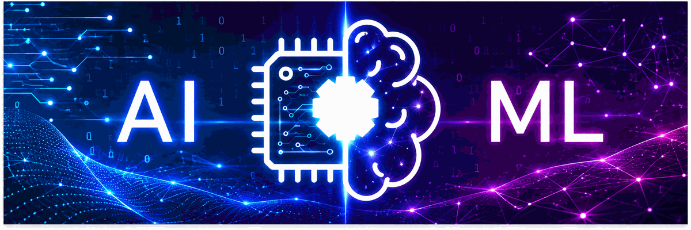

#  Hi there, I'm Vaishnavi Thaware

## I ❤️...

---

  

---

## 👩‍💻 About Me

- 🎓 B.Tech student specializing in **Artificial Intelligence**
- 🤖 Passionate about **Artificial Intelligence & Machine Learning**
- 🧠 Interested in **Deep Learning, Computer Vision & NLP**
- 📊 Exploring **Data Science and Predictive Analytics**
- 🚗 Working on **Autonomous Driving and Self-Driving Car Simulation**
- 💬 Interested in **Generative AI and Large Language Models**
- 💻 Building practical projects using **Python and Machine Learning**
- 🌱 Always learning and exploring new technologies
- 🎯 Aspiring to become a successful **AI/ML Engineer**
- 💡 Mission: Build **AI-powered solutions** that solve real-world problems

📫 **Reach me:** [vaishnavithaware719@gmail.com](mailto:vaishnavithaware719@gmail.com)

---

## 🚀 Featured Projects

### 🚗 Self-Driving Car

- AI-based autonomous driving simulation developed using the **Udacity Self-Driving Car Simulator**.
- Uses computer vision and deep learning to predict steering behavior.
- Working towards integrating intelligent voice/LLM-based interaction.

**Technologies:**  
`Python` `TensorFlow` `Keras` `OpenCV` `Deep Learning`

🔗 **View Repository:**  
https://github.com/vaishnavithaware24-ctrl/Self-driving-car

---

### 🤖 Simple Chatbot

- A Python-based chatbot project for conversational interaction.
- Demonstrates the fundamentals of chatbot development and NLP.

**Technologies:**  
`Python` `NLP` `Chatbot`

🔗 **View Repository:**  
https://github.com/vaishnavithaware24-ctrl/simple-chatbot

---

### 📧 Spam Email Classifier

- Machine Learning project that classifies emails as **Spam or Not Spam**.
- Includes data preprocessing, feature extraction and classification.

**Technologies:**  
`Python` `Pandas` `NumPy` `Scikit-learn` `NLP`

🔗 **View Repository:**  
https://github.com/vaishnavithaware24-ctrl/spam-email-classifier

---

### 🏠 House Price Prediction

- Machine Learning project for predicting house prices using property-related features.
- Includes data preprocessing, analysis, visualization and model training.

**Technologies:**  
`Python` `Pandas` `NumPy` `Matplotlib` `Scikit-learn`

🔗 **View Repository:**  
https://github.com/vaishnavithaware24-ctrl/house-price-prediction

---

## 🛠️ Tech Stack

### 💻 Programming Languages

- Python
- C
- C++
- Java

### 🤖 AI & Machine Learning

- Machine Learning
- Deep Learning
- TensorFlow
- Keras
- Scikit-learn
- OpenCV

### 📊 Data Science

- Pandas
- NumPy
- Matplotlib
- Data Analysis
- Data Visualization

### 🔧 Tools & Platforms

- Git
- GitHub
- VS Code
- Jupyter Notebook
- Google Colab

---

## 🧠 Areas of Interest

- 🤖 Artificial Intelligence
- 🧠 Machine Learning
- 🔬 Deep Learning
- 👁️ Computer Vision
- 💬 Natural Language Processing
- ✨ Generative AI
- 🧩 Large Language Models
- 🚗 Autonomous Systems
- 📊 Data Science
- 🔮 Predictive Analytics

---

## 📚 Currently Learning

- 🧠 Advanced Machine Learning
- 🔬 Deep Learning
- 👁️ Computer Vision
- ✨ Generative AI
- 💬 Large Language Models
- 🚗 Autonomous Driving
- 📊 Data Science
- ☁️ AI Model Deployment

---

## 🎯 My Goal

> **Learn → Build → Experiment → Improve → Create Impact**

My goal is to continuously improve my AI and Machine Learning skills and build **practical AI-powered solutions for real-world problems**.

---

## 📊 GitHub Stats

  

  

---

## 🔥 GitHub Streak

  

---

## 📈 Contribution Activity

  

---

## 🤝 Connect With Me

---

## 💫 Quote

  <i>"The future belongs to those who learn, build and innovate."</i>

  🚀 <b>Keep Learning • Keep Building • Keep Growing</b> 🚀

